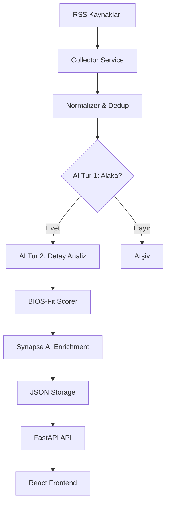

# Synapse 🛰️

**Avrupa Endüstriyel Haber Tarama Ajanı** — RSS tabanlı, yapay zekâ destekli, gerçek zamanlı haber analiz ve fırsat takip sistemi.

---

## 📖 Proje Hakkında

**Synapse**, Avrupa genelindeki endüstriyel hareketliliği (fabrika taşımaları, yeni tesis yatırımları, kapasite artışları ve kapanışlar) otomatik olarak takip etmek için tasarlanmış bir akıllı asistan sistemidir. Onlarca farklı haber kaynağını manuel taramak yerine, sistem bu kaynakları RSS üzerinden izler, yapay zekâ (LLM) ile analiz eder ve "BIOS-Fit" skorlama modeli ile iş geliştirme fırsatlarını önceliklendirir.

### Neden Synapse?
Sanayi dünyasında "zamanlama" her şeydir. Bir fabrikanın taşınacağını 6 ay önceden bilmek, o şirkete lojistik, ekipman veya danışmanlık hizmeti sunmak isteyen ekipler için paha biçilemez bir avantajdır. Synapse, bu dağınık veriyi toplayıp aksiyona dönüştürülebilir sinyallere çevirir.

---

## 🛠️ Teknoloji Yığını

| Katman | Teknoloji | Açıklama |
|--------|-----------|----------|
| **Frontend** | React 19, Vite, TailwindCSS 4 | Modern, hızlı ve responsive UI. |
| **State Management** | Zustand | Hafif ve performanslı state yönetimi. |
| **Backend** | FastAPI (Python 3.11) | Yüksek performanslı asenkron API. |
| **Yapay Zekâ** | Ollama (Llama 3 / 3.2) | Yerel, gizlilik odaklı ve maliyetsiz LLM. |
| **Veri Yapısı** | JSON / Local Files | Karmaşık veritabanı kurulumu gerektirmeyen esnek yapı. |
| **Analiz** | Feedparser, Langdetect | RSS çekme ve otomatik dil algılama. |

---

## 🚀 Kurulum ve Başlatma

### Gereksinimler
- **Python 3.11+**
- **Node.js 18+**
- **Ollama** ([İndir](https://ollama.ai))

### 1. Ollama Hazırlığı
Sistem yerel olarak çalışan Ollama'yı kullanır. Kurulumdan sonra aşağıdaki modeli çekin:
```bash
ollama pull llama3
```

### 2. Backend Kurulumu
```bash
cd bios-signal-radar/backend
python -m venv .venv

# Windows:
.venv\Scripts\activate
# Linux/macOS:
source .venv/bin/activate

pip install -r requirements.txt
cp .env.example .env
# .env dosyasında OLLAMA_BASE_URL=http://localhost:11434 ayarını kontrol edin.

python main.py
```

### 3. Frontend Kurulumu
```bash
cd bios-signal-radar/frontend
npm install
npm run dev
```
UI'a `http://localhost:5173` adresinden erişebilirsiniz.

---

## 🧠 Yapay Zekâ Pipeline ve Promptlar

Sistem, token verimliliğini artırmak ve isabet oranını yükseltmek için **2-turlu analiz (Two-Turn Analysis)** yaklaşımını kullanır.

### Tur 1: Ön Sınıflandırma (Relevance Filter)
Bu aşamada haberin endüstriyel bir sinyal taşıyıp taşımadığı kontrol edilir. Gereksiz haberler (spor, magazin vb.) burada elenir.

**Sistem Promptu:**
```text
You are an industrial news classifier for Synapse.
Classify whether a news article belongs to one of these RELEVANT signal categories:
1. FACTORY & PRODUCTION MOVEMENT - relocation, closure, new plant
2. WORKFORCE & RESTRUCTURING - mass layoffs, consolidation
3. STRATEGIC CORPORATE NEWS - M&A, bankruptcy, outsourcing
4. INVESTMENT & TENDER - major CapEx, equipment tenders
5. SECTOR DISRUPTION - industrial crisis
Return ONLY JSON: {"relevant": true/false, "confidence": 0.0-1.0, "signal_hint": "..."}
```

### Tur 2: Derin Analiz ve Veri Çıkarımı
İlk turdan geçen haberler için yapılandırılmış veri çıkarımı yapılır.

**Sistem Promptu:**
```text
Sen kıdemli bir endüstriyel istihbarat analistisin. 
Bu haberdeki olay tipini (relocation, expansion, closure vb.), şirket adını, 
lokasyonları, sektörü ve zaman çizelgesini çıkar. 
SADECE JSON döndür. Özeti Türkçe 2-4 cümle ile yaz.
```

---

## 📊 BIOS-Fit Skor Modeli

Haberlerin önem derecesi aşağıdaki formüle göre hesaplanır:

$$Score = 100 \times (0.30 \cdot E + 0.25 \cdot A + 0.20 \cdot G + 0.15 \cdot T + 0.10 \cdot C)$$

### Bileşenler ve Ağırlıklar
- **E (Event Type) - %30:** Olayın tipi (Taşıma=1.0, Yeni Fabrika=0.9, Kapanış=0.45).
- **A (Actor Clarity) - %25:** Şirket, Nereden, Nereye ve Sektör bilgilerinin ne kadar net olduğu.
- **G (Geography) - %20:** Avrupa içi operasyonlar en yüksek puanı alır.
- **T (Timeline) - %15:** Olayın ne kadar yakın bir gelecekte gerçekleşeceği.
- **C (Source Trust) - %10:** Kaynağın güvenilirliği (Resmi site > Ajans > Blog).

### ⚖️ Ağırlıkların Gerekçelendirilmesi
*   **Olay Tipi (%30):** En belirleyici faktördür. Bir ihale haberi ile komple bir fabrika taşıma haberi BIOS için farklı ticari değerler taşır.
*   **Aktör Netliği (%25):** İkinci önceliktir. Hangi şirketin, hangi şehirden nereye gittiği bilinmiyorsa, satış veya iş geliştirme ekipleri için bu haber "eyleme dönüştürülemez" bir veridir.
*   **Coğrafya (%20):** Pro Sicht'in ana operasyon alanı Avrupa olduğu için, kıta içi hareketlilik stratejik öneme sahiptir.
*   **Zaman ve Kaynak (%25 Toplam):** Bu bileşenler, yüksek kaliteli sinyalleri "ince ayar" ile öne çıkarmak için kullanılır.

> [!IMPORTANT]
> **Güven Cezası (Confidence Penalty):** Eğer AI tarafından çıkarılan kritik alanların doluluk oranı %40'ın altındaysa, skor otomatik olarak **0.50 ile çarpılarak** cezalandırılır. Bu, eksik veriye dayalı yanıltıcı sinyalleri engeller.

---

## 🏗️ Mimari Yapı



---

## 🔗 Test İçin RSS Kaynakları

Sistemi test etmek için aşağıdaki kaynakları kullanabilirsiniz:

| Kaynak | URL |
|--------|-----|
| Reuters Business | `https://feeds.reuters.com/reuters/businessNews` |
| Manufacturing.net | `https://www.manufacturing.net/rss` |
| IndustryWeek | `https://www.industryweek.com/rss` |
| Handelsblatt | `https://www.handelsblatt.com/contentexport/feed/schlagzeilen` |
| Just-Auto | `https://www.just-auto.com/rss` |

---

## 📄 Lisans ve Etik
Bu proje **BSMT Hackathon** kapsamında geliştirilmiştir. 
- **Veri Gizliliği:** Yerel LLM (Ollama) kullanımı sayesinde haber içerikleri dışarıya sızmaz.
- **Etik Kullanım:** Sadece herkese açık RSS kaynakları ve robots.txt uyumlu tarama yapılır.
